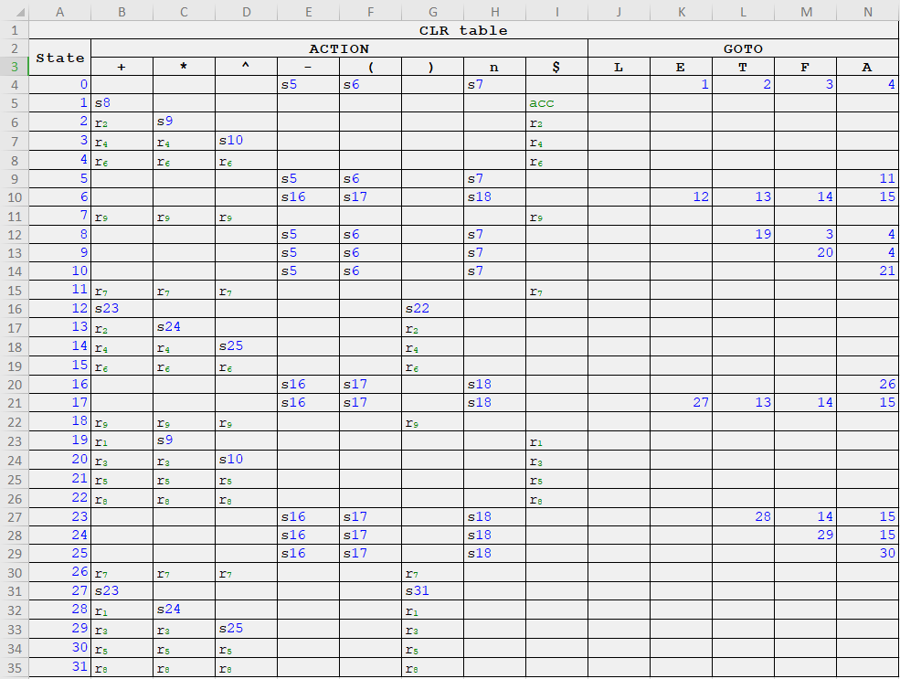
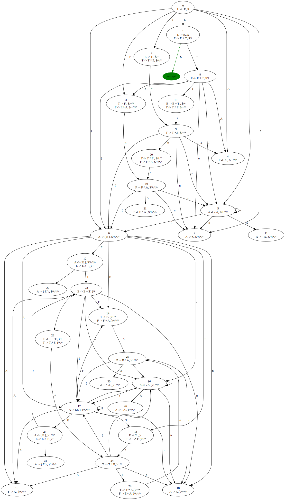

# CLR Parser

Implementation of  Calculator using Postfix SDT (given below) along with LR parsing. SDT steps also shown.

## Files

1. lex.py - It returns the token stream(list) of tokens for the given
   input string.
2. parser.py - It has the CLR parser logic along with SDT logic. For a given
   input it will output the parsing steps along with all the details of each
   step(stack status, action name, attribute calculation, etc)
3. Parse_table.csv - It has the parse table for the final grammar which is
   being used in the assignment.
4. CLR_Parse_Table.xlsx - For task 5 of the assignment.
5. automata.svg - For task 4 of the assignment.

##  > <b> Grammar </b>

1. L ⇒ E n 				      {print(E.val); }
2. E ⇒ E1+T 				   {E.val = E1.val+T.val; }
3. E ⇒ T 					   {E.val = T.val; }
4. T ⇒ T1\*F 				   {T.val = T1.val*F.val; }
5. T ⇒ F 						{T.val = F.val; }
6. F ⇒ F1^A 				   {F.val = F1.val^A.val; }
7. F ⇒ A 						{F.val = A.val; }
8. A ⇒ -A1 				      {A.val = -A1.val; }
9. A ⇒ (E) 					   {A.val = E.val; }
10. A ⇒ num 				   {A.val = num.lexval; }

---

## <b> Parse Table</b>

---

## <b> LR- 1 Automaton </b>

---

## Commands To Run

python .\parser.py

## Output

.PNG)

